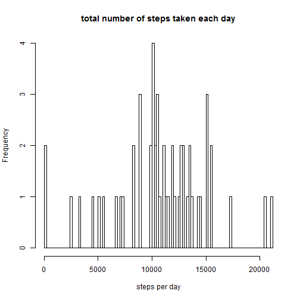
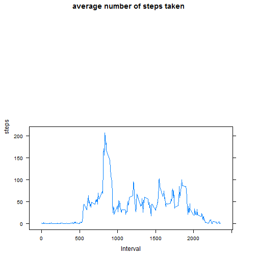
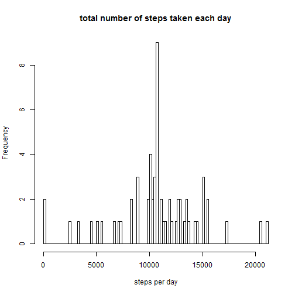
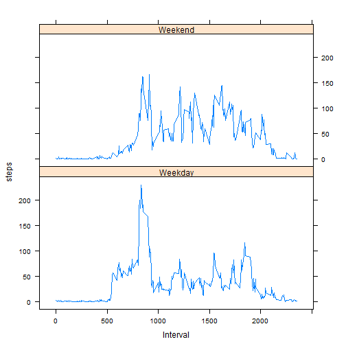

# Reproducible Research: Peer Assessment 1


## Loading and preprocessing the data

```r
input<-read.csv("data/activity.csv", header = TRUE, as.is=TRUE)
```

## What is mean total number of steps taken per day?
###remove na

```r
input <- input[!(is.na(input$steps)),]
o <- aggregate(input$steps, list(gp=input$date),sum)
hist(o$x,main="total number of steps taken each day",xlab="steps per day", breaks=100)
```

 

```r
mean(o$x)
```

```
## [1] 10766
```

```r
median(o$x)
```

```
## [1] 10765
```

## What is the average daily activity pattern?

```r
library(lattice)
f <- aggregate(input$steps, list(gp=input$interval),mean)
colnames(f) <- c("Interval","steps")
xyplot(steps ~ Interval, data = f, layout = c(1,2),type='l',main="average number of steps taken")
```

 

###number of steps: 

```r
f[which(f$steps==max(f$steps)),][2] 
```

```
##     steps
## 104 206.2
```
###at interval 

```r
f[which(f$steps==max(f$steps)),][1]  
```

```
##     Interval
## 104      835
```

## Imputing missing values

```r
input<-read.csv("data/activity.csv", header = TRUE, as.is=TRUE)
```
###replace NA with the average for that interval across all days

```r
for (i in 1:nrow(input)) {
    if (is.na(input$steps[i])) {
        input$steps[i] <- f$steps[which(f$Interval==input$interval[i])]
    }
}
o <- aggregate(input$steps, list(gp=input$date),sum)
hist(o$x,main="total number of steps taken each day",xlab="steps per day", breaks=100)
```

 

```r
mean(o$x)
```

```
## [1] 10766
```

```r
median(o$x)
```

```
## [1] 10766
```
- Replacing NA with averages does not impact results
- The earlier mean was done with NA removed, and NAs were replaced with average values


## Are there differences in activity patterns between weekdays and weekends?
### Convert 'day' to a factor variable

```r
input$wend <- as.factor(ifelse((as.POSIXlt(input$date)$wday) %in% 1:5, "Weekday", "Weekend"))

a <- split(input,input$wend)
b <- aggregate(a$Weekday$steps, list(gp=a$Weekday$interval),mean)
c <- aggregate(a$Weekend$steps, list(gp=a$Weekend$interval),mean)
b$wend <- "Weekday"
c$wend <- "Weekend"
d <- rbind(b,c)
colnames(d) <- c("Interval","steps","wend")

xyplot(steps ~ Interval | wend, data = d, layout = c(1,2),type='l')
```

 
